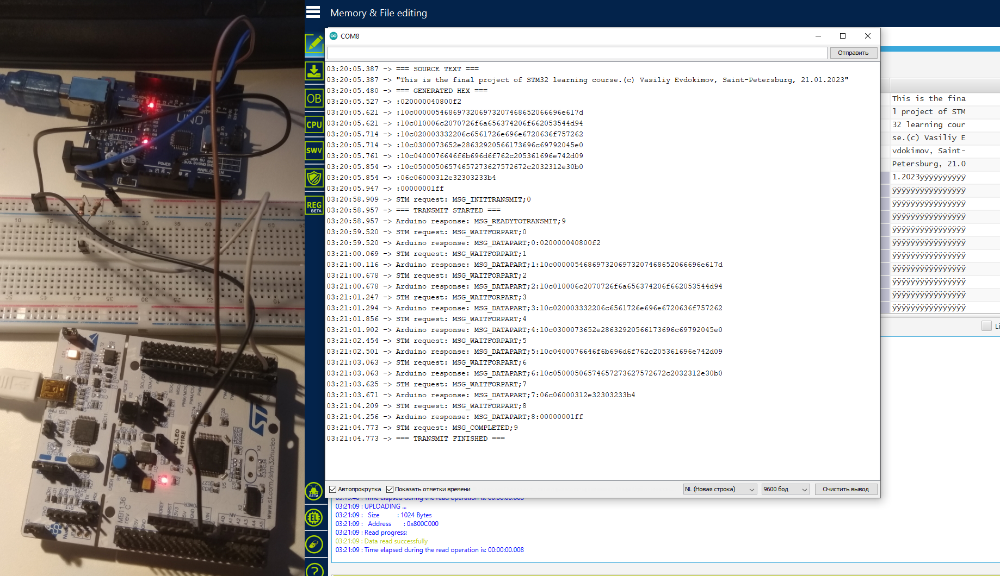

# arduino_stm32_ihex_uart_flash
In this small project following steps are realized:
- generation of data in intel hex format from random source text on the Arduino side;
- transfer data from Arduino to STM32 by request via UART using a simple messages format;
- parsing of incoming data and errors detection on the STM32 side;
- writing data to STM32 flash memory.
This is a project for module "ARM microcontrollers (STM32)" of "Embedded Systems Developer" training course.

